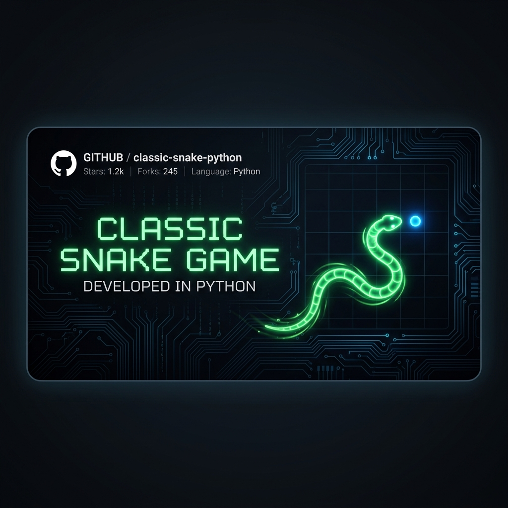
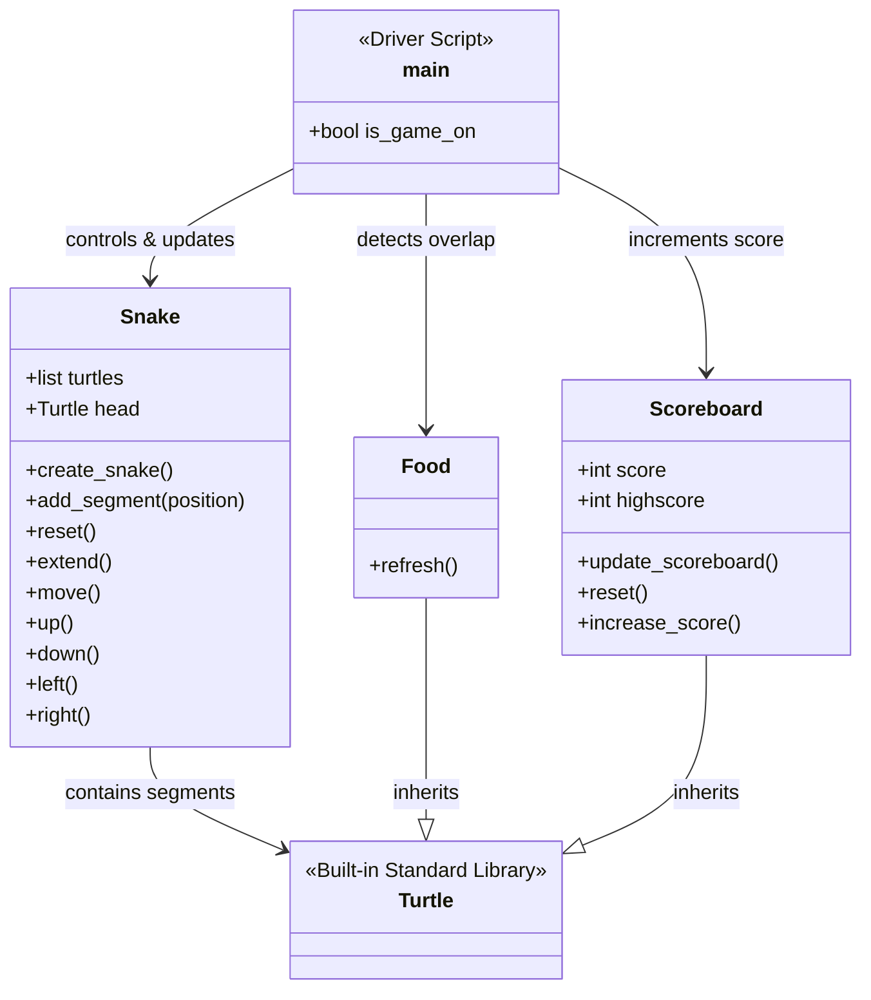

# 🐍 Classic Snake Game (GUI)

[](https://www.python.org/)
[](https://docs.python.org/3/library/turtle.html)
[](./Snake-Game/data.txt)
[](https://opensource.org/licenses/MIT)

A modern, polished implementation of the classic arcade **Snake Game** built in Python using the standard `turtle` graphics library. Featuring clean OOP design pattern modeling, real-time keyboard action hooks, automated segment growth, collision borders, and state-persistence high score tracking.

---

<p align="center">
  
</p>

---

## 🗺️ Repository Structure

```text
├── Snake-Game/               # Directory containing Python source files
│   ├── main.py               # Entry point of the game (main game loop)
│   ├── snake.py              # Snake class (controls movement & length growth)
│   ├── Food.py               # Food class (random coordinate generator)
│   ├── scoreboard.py         # Scoreboard class (rendering & persistence logic)
│   └── data.txt              # Local file preserving high score records
├── assets/                   # Repository media files
│   └── banner.png            # Visual repository banner
└── README.md                 # Interactive documentation (this file)
```

---

## 🎮 Game Controls

Navigate the snake around the coordinate plane using standard directional keys:

| ⌨️ Key | 🧭 Direction | 🚫 Constraint Rules |
| :--- | :--- | :--- |
| **Up Arrow** | Move Up | Cannot switch to Down direction directly |
| **Down Arrow** | Move Down | Cannot switch to Up direction directly |
| **Left Arrow** | Move Left | Cannot switch to Right direction directly |
| **Right Arrow** | Move Right | Cannot switch to Left direction directly |

---

## 🛠️ Key Features

- **⚡ Fluid Controls:** Built on non-blocking event listener loops (`screen.listen()`).
- **🍎 Food Regeneration:** Food segments dynamically place themselves in random coordinates checking coordinate grids.
- **💾 Local State Persistence:** High scores are written to and read from `data.txt` to preserve records across separate runs.
- **💥 Collision Logic:** Dynamic checks for self-collision (tail biting) and perimeter boundary hits.
- **🔄 Auto-Reset loop:** Instantly resets the snake and updates high scores without application crashes.

---

## 🏗️ Architecture & Class Structure

The application is built modularly using strict Object-Oriented guidelines. Here is the class relation mapping:



---

## 🔍 Interactive Game Details

<details>
<summary>⚡ View Module Descriptions & Logic Flow</summary>

- **`main.py`:** Initiates screen setup (600x600 px), starts the game loop with `time.sleep(0.1)` refresh frequencies, binds key listeners, and checks for three core event triggers:
  1. *Food Collisions:* Distance check `< 15` pixels.
  2. *Wall Collisions:* X or Y coordinates reaching absolute boundary limit `280` pixels.
  3. *Tail Collisions:* Snake head approaching any trailing segments within `< 10` pixels.
- **`snake.py`:** Holds segment array representations. When resetting, segments are moved off-screen to clear active canvases, and a new snake is generated at `(0,0)`.
- **`Food.py`:** Modulates a customized blue circle representing prey, changing locations on coordinates using Python's `random` package.
- **`scoreboard.py`:** Reads high scores from `data.txt`. Updates score indicators dynamically on the top header.
</details>

---

## 🚀 How to Run

### Prerequisites
- Python 3.x installed (Turtle is built into Python's standard package suite).

### Execution Steps
1. **Clone the repository:**
   ```bash
   git clone https://github.com/asad594/Snake-Game.git
   ```

2. **Navigate into the game source folder:**
   ```bash
   cd Snake-Game/Snake-Game
   ```

3. **Launch the game:**
   ```bash
   python main.py
   ```

*Enjoy competing for the highest score! The score updates dynamically in `data.txt` every time you beat your previous record.*

---

## 🤝 Contributing
Contributions, feature enhancements (like levels or speeds), and feedback are welcome!
1. Fork this project.
2. Create your feature branch (`git checkout -b feature/AmazingFeature`).
3. Commit your changes (`git commit -m 'Add some AmazingFeature'`).
4. Push to the branch (`git push origin feature/AmazingFeature`).
5. Open a Pull Request.

---

## 📜 License
Distributed under the **MIT License**. See `LICENSE` for details.
